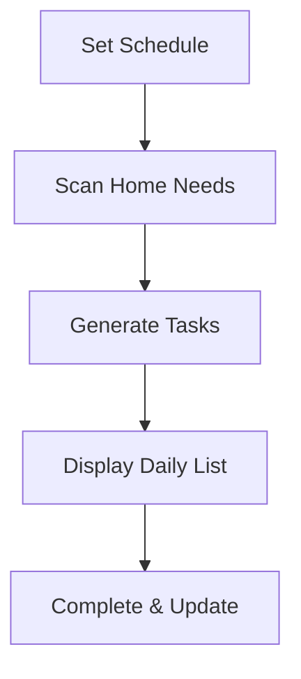

## Overview

ForgeKit transforms cleaning into a calm, rewarding experience designed specifically for ADHD brains. You get gentle guidance without overwhelming lists or guilt. Core features focus on calming visuals, smart automation, supportive nudges, and motivating gamification to help you maintain a tidy home effortlessly.

<Callout kind="info">
These features prioritize focus, immediate rewards, and privacy, ensuring cleaning fits your natural rhythms.
</Callout>

## Key Features

Discover the standout elements that set ForgeKit apart.

<Columns cols={3}>
  <Card title="Calming Design" icon="zap" href="#calming-design">
    Soft colors and minimal layouts reduce anxiety and promote focus.
  </Card>
  <Card title="Smart Scheduling" icon="calendar" href="#smart-scheduling">
    Automatic daily tasks based on your home's needs.
  </Card>
  <Card title="Gentle Reminders" icon="bell" href="#gentle-reminders">
    Supportive notifications like a friend's nudge.
  </Card>
  <Card title="Gamification" icon="star" href="#gamification">
    Streaks and rewards deliver instant dopamine hits.
  </Card>
</Columns>

## Calming UI and Color Scheme

ForgeKit uses soft teals (`#0D9488`) and greens to create a serene interface. These colors, backed by research, lower stress and enhance concentration.

<Image
  src="https://via.placeholder.com/800x400/0D9488/FFFFFF?text=Calming+UI"
  alt="Screenshot of ForgeKit's calming teal and green interface"
  width="800"
  height="400"
/>

No clutter means you focus on tasks, not distractions.

<Callout kind="tip">
Customize accent colors in settings to match your preferences while keeping the calming base.
</Callout>

## Daily Task Generation and Scheduling

Set your cleaning schedule once, and ForgeKit generates personalized daily tasks. It prioritizes rooms needing attention based on your patterns.

### Set Up Your Schedule

<Steps>
  <Step title="Open Settings" icon="settings">
    Navigate to the schedule tab.
  </Step>
  <Step title="Define Rooms" icon="home">
    Add rooms like kitchen, living room.
  </Step>
  <Step title="Set Frequency" icon="calendar">
    Choose daily, weekly for each task.
  </Step>
  <Step title="Save & Activate" icon="check">
    Tasks auto-generate starting tomorrow.
  </Step>
</Steps>

## Gentle Reminders and Notifications

Notifications arrive as encouraging messages, timed for your productive windows. Opt-in for tones that soothe rather than startle.

<Tabs>
  <Tab title="iOS" icon="apple">
    Enable in device settings: Settings > Notifications > ForgeKit > Customize sounds.
  </Tab>
  <Tab title="Android" icon="android">
    App Settings > Reminders > Select gentle chimes and times.
  </Tab>
</Tabs>

## Gamification with Streaks and Rewards

Earn points, build streaks, and unlock badges for motivation. Completing "Vacuum living room" gives +10 points and streak updates.

<Expandable title="View Your Stats" default-open="true">
  Track progress privately. Streaks reset softly with tips to restart.

  | Metric       | Description                  | Example     |
  |--------------|------------------------------|-------------|
  | Current Streak | Consecutive days completed  | 7 days     |
  | Total Points | Lifetime achievements       | 1,250 pts  |
  | Badges       | Milestones unlocked         | Gold Star  |
</Expandable>

<Tabs>
  <Tab title="Daily View" icon="sun">
    See tasks and streak counter on home screen.
  </Tab>
  <Tab title="Rewards" icon="trophy">
    Redeem points for custom themes or animations.
  </Tab>
</Tabs>

## Next Steps

<Columns cols={2}>
  <Card title="Quick Start" icon="rocket" href="/quickstart">
    Set up in under 5 minutes.
  </Card>
  <Card title="Customization" icon="paint-brush" href="/configuration">
    Tailor features to your needs.
  </Card>
</Columns>

<Callout kind="success">
Ready to tidy? Download from [Google Play](https://play.google.com/store/apps/details?id=com.forgekit.tidy) and start your first streak today.
</Callout>